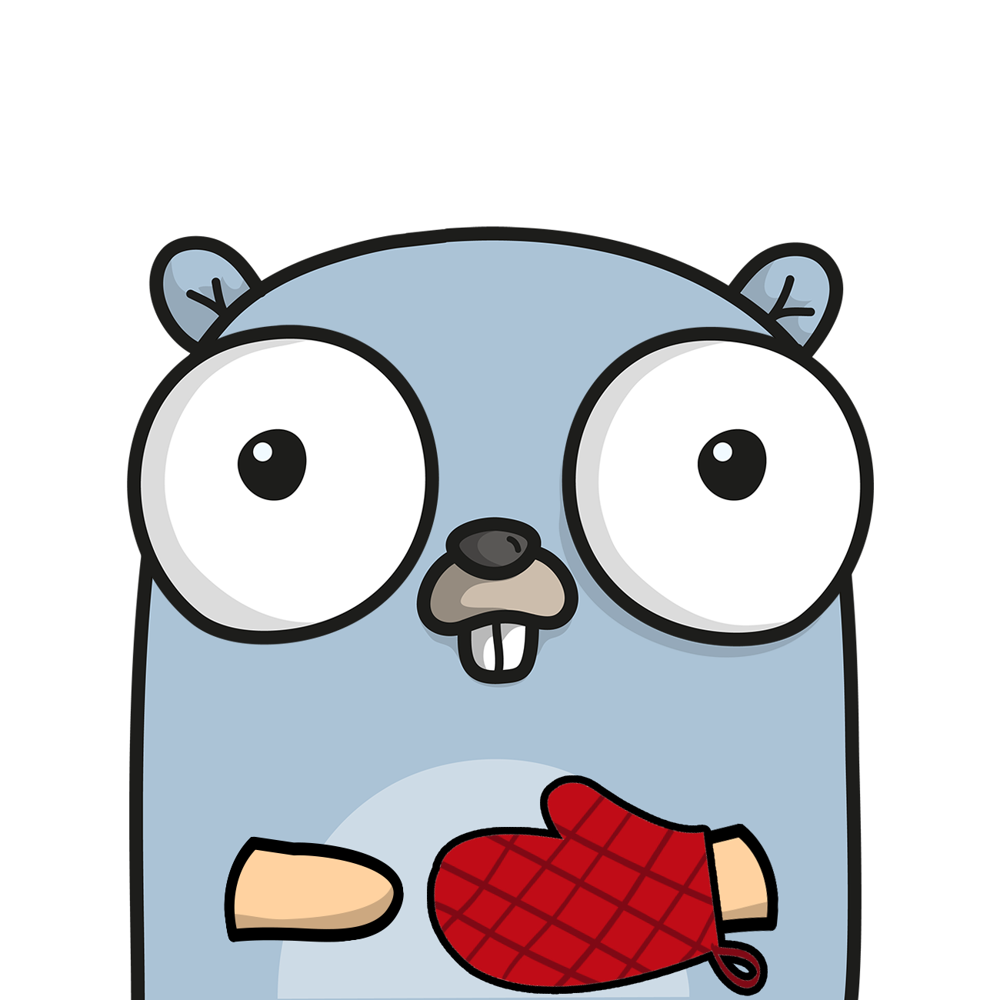

<h1> Glove: Build forward proxies in Golang</h1> 

Glove is a framework for developing HTTP/HTTPS forward proxies in Golang that makes it easy to implement a custom logic
for processing HTTP/HTTPS traffic that is passing through the proxy.

[![GitHub Test Badge][1]][2] [![codecov.io][3]][4] [![Goreport][5]][6] [![License][7]][8]

[1]: https://github.com/pmateusz/glove/actions/workflows/build-master-branch.yaml/badge.svg "GitHub Test Badge"

[2]: https://github.com/pmateusz/glove/actions "GitHub Actions Page"

[3]: https://codecov.io/gh/pmateusz/glove/branch/master/graph/badge.svg?branch=master "Coverage Badge"

[4]: https://codecov.io/gh/pmateusz/glove?branch=master "Codecov Result"

[5]: https://goreportcard.com/badge/github.com/pmateusz/glove "Goreportcard Badge"

[6]: https://goreportcard.com/report/github.com/pmateusz/glove "Goreportcard Result"

[7]: https://img.shields.io/github/license/pmateusz/glove "License Badge"

[8]: https://opensource.org/license/bsd-3-clause "License"

## Why you may actually want to build a forward proxy?

The ability to introspect and alter HTTP/HTTPS traffic passing by a forward proxy could be used to address many
technical problems that arise during integration with external APIs:

- Logging and auditing of requests and responses,
- Enforcing access control measures to restrict communication with the origin server, i.e., blocking access to certain
  hosts or a subset of endpoints,
- Signing requests on behalf of the client, secret rotation, and secret access policy management are simplified because
  API keys don't need to be disclosed to the client,
- Queuing requests from multiple clients to mitigate the risk of throttling, and to prevent escalation of throttling
  events,
- Providing consistent retry policy in response to timeouts and throttling events.

There are no universal solutions for the scenarios mentioned above. For that reason, instead of attempting to provide
opinionated solutions, Glove focuses on helping to plug in arbitrary code for processing HTTP/HTTPS requests and
responses implemented in Golang.

## Features

Glove supports processing HTTP and HTTPS traffic. The introspection of HTTPS traffic is conditional on the successful
TLS handshake between the clients and the proxy. Subsequently, the proxy acts as the man-in-the-middle (**MITM**)
passing a request received from the client to the origin server. The server might not be aware the request received from
the proxy was sent on behalf of some other client. Once the origin server replies, the proxy is responsible for passing
the response back to the client.

Besides MITM, Glove supports **TCP tunneling** (a.k.a. transparent proxy). In contrast to MITM, which requires the
client to accept a TLS handshake with the proxy, in TCP tunneling the handshake is established between the client and
the origin server. The proxy responsibility is restricted to accepting the TCP connection requested by the client,
establishing a TCP
connection with the origin server, and copying a stream of bytes between both connections. Traffic passing through the
proxy is encrypted. Consequently, introspection of HTTPS communication is not available, and custom handlers are not
executed. TCP tunneling doesn't require any additional configuration of the client and the proxy. The primary motivation
for setting up a proxy for TCP tunneling is to prevent the client's IP address/location from being discovered. As the
origin server
receives traffic for the IP address of the proxy, it is not aware of the client's whereabouts.

Glove supports **websockets** in the MITM mode. Specifically, Glove responds to an HTTP/HTTPS request to upgrade the
protocol to a websocket by switching the mode of handling the connection from MITM to TCP tunneling.

Finally, besides core forward proxy abilities, Glove provides some auxiliary features:

- Ability to **customize TLS configuration** used by the proxy based on the client host or the origin server,
- **IP and CIDR whitelisting** of hosts allowed to connect to the proxy.

## Mission Statement

As authors, our mission was to develop a useful framework that will help build high-quality solutions for technical
problems arising in a broad range of applications in a time-efficient manner. The project is open source and licensed
using a permissive BSD-type license, which makes it effectively free for commercial applications.

## Sponsorship

Future project maintenance relies on financial support. Please consider sponsorship or a donation if the framework
benefits your project or the company. We thank private and corporate sponsors for their generous financial support.

## License

This project is licensed under the terms of the [3-Clause BSD](./License.md) License.

## References

- [**Developer Guide**](./docs/developer-guide.md)